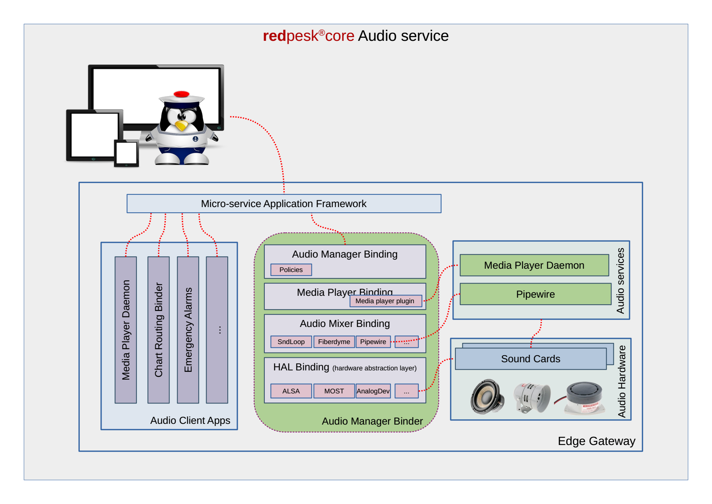

# Core Services

While redpesk@SEA is fully open an may potentially support any kind of services. Most user expect some core services to be provided "out-of-the-box". This list of core services may expend in the future, but as today we expect to ship with default open source version following components:

## Signaling

Automotive Linux support in its current version CAN and J1939. For redpesk@SEA, IoT.bzh already added support for CanOpen and Modbus as well as as a reverse engineered version of [NMEA2000](https://www.nmea.org/Assets/20090423%20rtcm%20white%20paper%20nmea%202000.pdf) based on [Canboat](https://github.com/canboat/canboat) and other works.

Signaling split into low level binding that are in charge of decoding a binary message (N2K, CanOpen, Modbus, ...) into a high level structure that is easy to process by an application. Second level is handled by the signal composer that is in charge of composing message to build a functional signal when the boat moved more than 300m. The goal is this model is to reduce as close as possible from the acquisition the number of processed messages.

{:: style="margin:auto; display:flex; max-width:80%;"}

For further details on [signaling model check](https://iot.bzh/en/publications/32-2018/92-updated-overview-of-agl-signaling)

## Chart & Routing

redpesk@SEA aims at providing core low level chart service. A full UI as OpenCPN or QtVLM remains out of scope. Nevertheless we aim at providing a strong chart core set of chart services to help that the community to easily develop multiple user interfaces targeting the difference class of maritime users (leisure, fisherman, researcher, ship-yard, harbour, ...).

In a first run, chart service should be able to provide a vector tile service compatible with Mapbox. Chart service should support both a realtime service to serve tiles on demand to UI clients through a standard set of APIs, as well as an out of band service to translate with GDAL or equivalent technology charts from their delivery format(S57,S101,...) into a set of vector tiles compatible with [Mapbox vector tiles format](https://docs.mapbox.com/vector-tiles/specification/)

We also target a basic "safe routing" service. This service might leverage [H3 Uber’s Hexagonal Hierarchical Spatial Index](https://eng.uber.com/h3/) to provide an electronic version of "second captain" that permanently controls if current boat direction is safe or not. The initial version might be limited to static information like maritime charts sounding information or AIS history, nevertheless in a second version we should also leverage dynamic information as Radar, realtime sounding, ...

{:: style="margin:auto; display:flex; max-width:80%;"}

## Cloud Connectivity

Exchanging data with Internet for both incoming and outgoing streams in a secure manner is critical to support many modern use cases. This secure connection is required to support both external devices (phone, tablet) connecting directly on a boat gateway, or 4G/Satellite connectivity with a cloud service.

As by definition boat can get far enough from ground antenna to loose connectivity, it is key to support connection break down as well as stream selection to limit satellite communication cost.

As cloud connectivity, the initial implementation proposes a mechanism not only to secure stream from/to the cloud, but also a standard option to stage data on the edge waiting for adequate connectivity to be available.

{:: style="margin:auto; display:flex; max-width:80%;"}

## Native Graphic

While not everyone requires native graphic support, anyone who needs to support an embedded screen to display UI will need some form of graphical support.

For remote UI, HTML5 is the magic wand. Unfortunately for native screen support, Wayland only provides very low level API and needs to be complemented in order to support application developers. In order to support Linux existing UI, the system should support XDG as well as some hight level compositor foundation as WLRoot, Fluter or others. While no compositor will ever support every use cases, reference implementation should support one that enable people to get native UI working almost our of the box.

## Monitoring

Monitoring is a key requirement for any long term supported system. Monitoring should be able to support multiple use cases as:

* Enabling developers to trace requests in realtime when debugging
* Collecting long term data track when doing final in situation QA test
* On line data collection to track security break, functional errors, usage patterns, ...

redpesk@SEA inherits from Automotive Linux application framework monitoring capabilities, it can introspect service API, hook incoming/outgoing messages and support a standard monitoring of Linux general behavior (CPU, RAM, Network, ...). All collected data can either be displayed in realtime (debug case) or stored in a timeserie database for further use with standard tools as Graphana or others.

{:: style="margin:auto; display:flex; max-width:80%;"}

## Multimedia

Audio requirement for Automotive is probably too complex for maritime usage and redpesk@sea might only use a subset of AGL audio system. Nevertheless some key functionalities as zones, roles, priorities, ... may soon become hard requirements. At minimum we target:

* a service to play basic multimedia stream as MPD *(Multimedia Player Daemon)*
* a priority service to play emergency sounds *(anchor, AIS, flooding, ...)*
* support of advanced hardwares (MOST, Analog Device, DSP, ...)
* support of sound short cut for safety/emergency sound
* ramp up/down when moving from one stream to an other

In order to minimize the impact on existing Linux applications, the system should provide an ALSA interface for audio stream and use an independent set of API to manage privilege and security policies.

{:: style="margin:auto; display:flex; max-width:80%;"}
